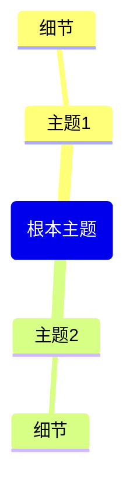

基于上下文里提供的网页内容（来自 Obsidian 网页剪藏插件或网页查看器），生成一份完整的 Obsidian 笔记。

**重要提示：若未找到网页上下文，请提醒用户执行以下操作：**

1. 在网页查看器中打开一个网页（或使用 @选择网页标签）
2. 或打开由 Obsidian 网页剪藏插件剪藏的笔记
3. 然后再次使用该指令

按照以下固定结构生成笔记：

---
title: "<页面标题>"
source: "< 页面网址 >"
description: "< 简要描述 >"
tags:
  - "clippings"
---

## 内容摘要

<对页面内容进行 2-3 段的简短总结>

## 核心要点

<以项目符号形式列出 5-8 个核心要点>

## 思维导图

**Mermaid 思维导图语法规则（必须严格遵守）：**

- 根节点格式：root (主题名称) —— 使用圆括号，**不要**使用双层括号
- 子节点：直接写纯文本即可，无需括号
- 文本中**不要**使用引号、圆括号、方括号或任何特殊字符
- 所有节点文字保持简短，每个节点最多 3-4 个单词

## 精彩摘录

<从内容中摘录 3-5 条值得注意的语句（如有）>

**仅返回 Markdown 内容，不附带任何解释或注释。**